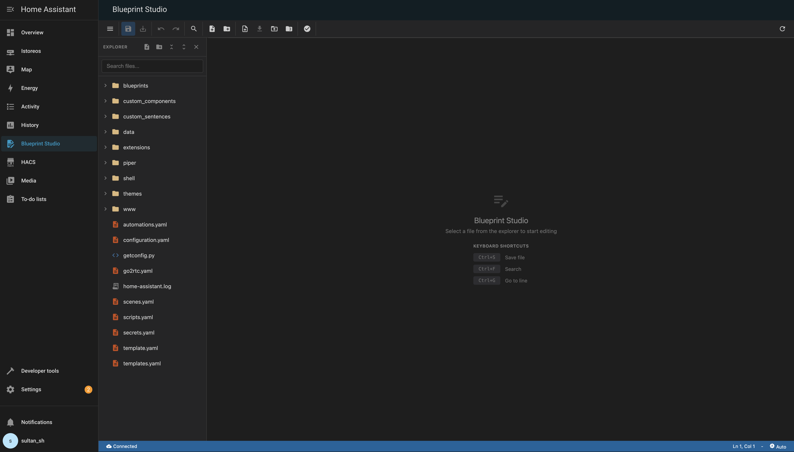
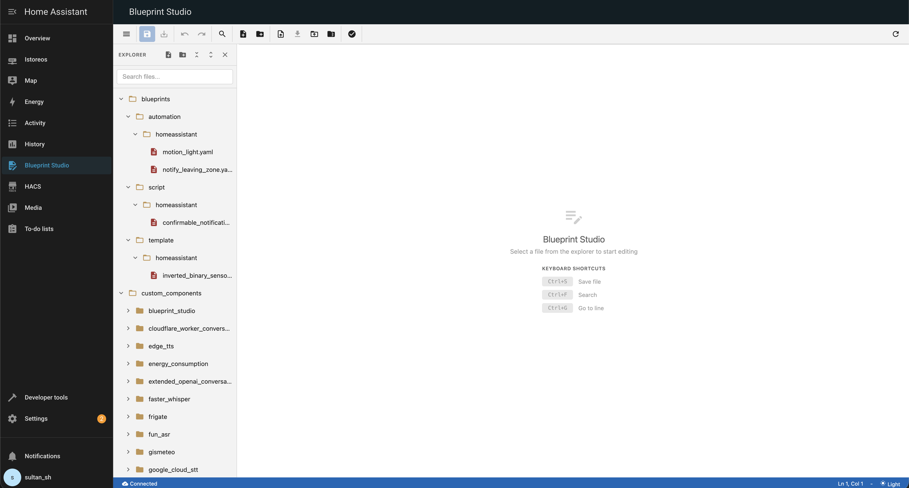
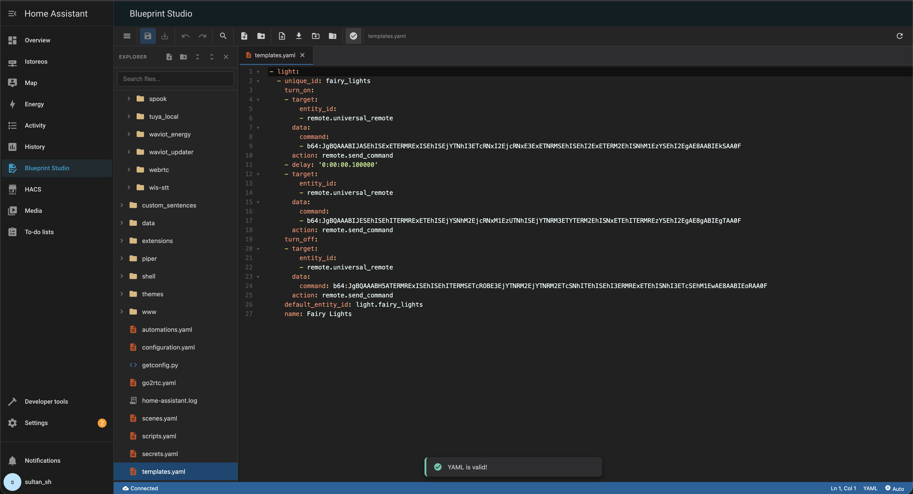
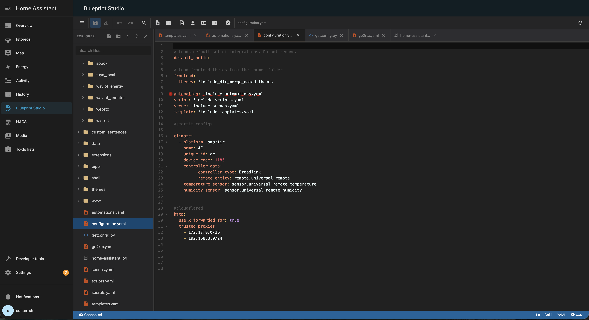

# Blueprint Studio 🚀

[](https://github.com/hacs/integration)
[](https://github.com/soulripper13/blueprint-studio/releases)
[](LICENSE)


[](https://github.com/soulripper13/blueprint-studio)
[](https://github.com/soulripper13/blueprint-studio/issues)

<div align="center">
  
  <br><br>
  <strong>A modern, feature-rich file editor for Home Assistant. Edit your YAML configuration files and other text-based files directly from the Home Assistant UI with a professional VS Code-like experience. Say goodbye to clunky SSH sessions and hello to seamless editing! ✨</strong>
</div>

---

## 📖 Table of Contents
- [Why Blueprint Studio? 🌟](#why-blueprint-studio-)
- [Screenshots 📸](#screenshots-)
- [✨ Features](#-features)
- [🔧 Installation](#-installation)
- [⚙️ Configuration](#️-configuration)
- [🚀 Usage](#-usage)
- [📄 Supported File Types](#-supported-file-types)
- [🔒 Security](#-security)
- [🛠️ Troubleshooting](#️-troubleshooting)
- [❓ FAQ](#-faq)
- [🔍 Technical Details](#-technical-details)
- [🤝 Contributing](#-contributing)
- [🗺️ Roadmap](#️-roadmap)
- [📞 Support](#-support)

---

## Why Blueprint Studio? 🌟
Tired of juggling external editors, SSH, or add-ons just to tweak your Home Assistant configs? Blueprint Studio brings the power of a full-fledged IDE right into your HA dashboard. Here's why it's a game-changer:

- **No External Tools Required** - Edit files directly in Home Assistant without SSH or file shares 🚫
- **Professional Editor** - Full-featured code editor with syntax highlighting and linting 💻
- **Safe & Secure** - Built-in protection against path traversal and unauthorized access 🛡️
- **Multi-File Editing** - Work with multiple files simultaneously using tabs 📁
- **File Management** - Create, delete, rename, copy, upload, and download files and folders 📂

---

## Screenshots 📸

<div align="center">

### Main Editor Interface
*Edit your Home Assistant configuration files with syntax highlighting and professional tools*



---

### File Tree & Multi-Tab Support
*Navigate your config directory and work with multiple files simultaneously*



---

### Real-Time YAML Validation
*Catch errors before saving with built-in YAML linting*



---

### Multi-Tab Editing in Action
*Work efficiently with multiple files open at once*



</div>

> **📝 Note:** To add screenshots, simply place PNG images in the `images/` folder with these names:
> - `screenshot.png` - Main editor interface
> - `screenshot-file-tree.png` - File tree explorer
> - `screenshot-yaml-validation.png` - YAML validation
> - `screenshot-multi-tab.png` - Multi-tab editing (optional)

<div align="center">
  
</div>

---

## ✨ Features

### Editor Features 🎨
- **Syntax Highlighting** - Support for YAML, JSON, Python, JavaScript, HTML, CSS, Markdown, and Shell scripts 🌈
- **Code Folding** - Collapse and expand code sections for better focus 📜
- **Line Numbers** - Easy navigation with line numbers 🔢
- **Active Line Highlighting** - See your cursor position clearly 🎯
- **Bracket Matching** - Automatic bracket highlighting 🧩
- **Auto-close Brackets** - Automatic bracket completion ⌨️
- **YAML Linting** - Real-time YAML syntax validation with error highlighting ❌

### UI Features 🎨
- **Dark Theme** - VS Code-inspired dark theme for eye-friendly editing 🌙
- **File Tree Explorer** - Navigate your config directory with an expandable folder tree 🌳
- **File Type Icons** - Different colored icons for various file types 🎨
- **Multiple Tabs** - Open and edit multiple files simultaneously 🗂️
- **Resizable Sidebar** - Drag to resize the file explorer 📏
- **File Search** - Filter files in the explorer 🔍
- **Status Bar** - Shows cursor position, file type, and connection status 📊
- **Toast Notifications** - Elegant success/error messages 🔔

### File Management 📁
- **Create Files & Folders** - Right-click context menu for creating new items ➕
- **Upload Files** - Drag & drop or click to upload files from your computer ⬆️
- **Download Files** - Download individual files or entire folders as ZIP ⬇️
- **Copy & Paste** - Duplicate files and folders 📋
- **Rename & Move** - Rename files or move them to different locations 🔄
- **Delete** - Remove files and folders (with protection for critical files) 🗑️
- **Folder Operations** - Upload/download entire folder structures as ZIP files 📦

### Toolbar 🛠️
- Save / Save All 💾
- Undo / Redo ↶↷
- Cut / Copy / Paste ✂️📋
- Search / Replace 🔍🔄
- YAML Validation ✅
- Refresh file list 🔄
- Collapse/Expand all folders 📂📁
- Upload/Download files and folders ⬆️⬇️

### Keyboard Shortcuts ⌨️
| Shortcut | Action |
|----------|--------|
| `Ctrl+S` / `Cmd+S` | Save file 💾 |
| `Ctrl+Shift+S` / `Cmd+Shift+S` | Save all files 💾📁 |
| `Ctrl+F` / `Cmd+F` | Search in file 🔍 |
| `Ctrl+H` / `Cmd+H` | Search and replace 🔄 |
| `Ctrl+G` / `Cmd+G` | Go to line 📍 |
| `Ctrl+/` / `Cmd+/` | Toggle comment 💬 |
| `Ctrl+W` / `Cmd+W` | Close tab ❌ |
| `Ctrl+Z` / `Cmd+Z` | Undo ↶ |
| `Ctrl+Y` / `Cmd+Shift+Z` | Redo ↷ |

---

## 🔧 Installation
This integration is best installed via the [Home Assistant Community Store (HACS)](https://hacs.xyz/).

### HACS (Recommended) 🛠️
1. **Add the Custom Repository**:
    * Ensure HACS is installed.
    * Go to **HACS > Integrations > ... (three dots) > Custom repositories**.
    * Add this repository's URL: `https://github.com/soulripper13/blueprint-studio`
    * Select the category **Integration** and click **Add**.
 
      [](https://my.home-assistant.io/redirect/hacs_repository/?owner=soulripper13&repository=blueprint-studio&category=integration)
  
      [](https://my.home-assistant.io/redirect/config_flow_start/?domain=blueprint_studio)
      
2. **Install the Integration**:
    * In HACS, search for "Blueprint Studio" and click **Download**.
    * Follow the prompts to complete the download.
3. **Restart Home Assistant**:
    * Go to **Settings > System** and click the **Restart** button.
4. **Add the Integration**:
    * Go to **Settings > Devices & Services > Add Integration**.
    * Search for and select **Blueprint Studio**.
    * The setup wizard will guide you through the final configuration steps.

### Manual Installation 📥
1. Download the latest release from the [releases page](https://github.com/soulripper13/blueprint-studio/releases) 📦
2. Extract the `blueprint_studio` folder to your `custom_components` directory 📂
3. Restart Home Assistant 🔄
4. Go to Settings → Devices & Services → Add Integration → Blueprint Studio ⚙️

<div align="center">
  
</div>

---

## ⚙️ Configuration
Blueprint Studio requires **no configuration**! After installation:
1. The integration will appear in Settings → Devices & Services 📋
2. A new "Blueprint Studio" menu item will appear in your Home Assistant sidebar 📂
3. Click it to start editing your files 🚀

**Note:** Blueprint Studio is admin-only for security reasons. Only users with administrator privileges can access it. 👑

---

## 🚀 Usage
### Opening Files 📂
- Click on any file in the file tree to open it in the editor 🖱️
- Files open in new tabs, allowing you to work with multiple files simultaneously 🗂️
- Use the file search box to quickly find files 🔍

### Editing Files ✏️
- Make your changes in the editor 🎨
- Press `Ctrl+S` (or `Cmd+S` on Mac) to save 💾
- Use `Ctrl+Shift+S` to save all open files at once 📁

### Creating New Files ➕
- Right-click in the file tree where you want to create the file 🖱️
- Select "New File" or "New Folder" 📄
- Enter the name and the file will be created ✨

### Uploading Files ⬆️
- Use the upload button in the toolbar 📤
- Drag and drop files directly into the upload dialog 🖱️
- Choose whether to overwrite existing files ❓

### Downloading Files ⬇️
- Right-click on a file or folder 🖱️
- Select "Download" 📥
- Folders are downloaded as ZIP files 📦

### YAML Validation ✅
- Click the YAML validation button in the toolbar 🔍
- Any syntax errors will be highlighted in red ❌
- Hover over errors to see the error message 💡

---

## 📄 Supported File Types
| Extension | Language | Icon |
|-----------|----------|------|
| `.yaml`, `.yml` | YAML | 🟡 |
| `.json` | JSON | 🔵 |
| `.py` | Python | 🐍 |
| `.js` | JavaScript | ⚡ |
| `.html` | HTML | 🌐 |
| `.css` | CSS | 🎨 |
| `.md` | Markdown | 📝 |
| `.sh` | Shell | 🐚 |
| `.txt`, `.log` | Plain Text | 📄 |
| `.conf`, `.cfg`, `.ini` | Config | ⚙️ |

---

## 🔒 Security
Blueprint Studio includes multiple layers of security protection to keep your HA instance safe:

- **Path Traversal Protection** - Prevents access to files outside your Home Assistant config directory 🚫
- **Admin Only Access** - Only users with administrator privileges can use the editor 👑
- **Allowed File Extensions** - Only text-based configuration files can be edited (see Supported File Types) 📄
- **Excluded Directories** - Sensitive directories like `.storage`, `deps`, and `__pycache__` are hidden 🕶️
- **Protected Files** - Critical files like `configuration.yaml` and `secrets.yaml` cannot be deleted (but can be edited) 🛡️
- **Input Validation** - All file operations are validated to prevent malicious input 🔍
- **Authentication Required** - All API endpoints require Home Assistant authentication 🔐

**Best Practices:**
- Always backup your configuration before making major changes 💾
- Use YAML validation before saving configuration files ✅
- Test changes in a development environment when possible 🧪
- Keep regular backups of your Home Assistant configuration 🔄

---

## 🛠️ Troubleshooting
### Integration doesn't appear in sidebar ❓
- Ensure you've restarted Home Assistant after installation 🔄
- Check that you're logged in as an administrator 👑
- Clear your browser cache and refresh the page 🧹
- Check the Home Assistant logs for any errors 📋

### Files not showing in the tree 📂
- Some directories are excluded for security (`.storage`, `deps`, `.cache`, etc.) 🛡️
- Hidden files (starting with `.`) are not shown 🕶️
- Only files with supported extensions are displayed 📄
- Try clicking the refresh button in the toolbar 🔄

### Cannot save files 💾
- Ensure you have write permissions on the config directory 🔑
- Check that the file extension is in the allowed list 📄
- Verify there's enough disk space 💾
- Check the Home Assistant logs for permission errors 📋

### YAML validation shows errors ❌
- Review the error message by hovering over the red highlighted area 💡
- Common issues: incorrect indentation, missing colons, unquoted special characters 📝
- Use an online YAML validator for complex debugging 🌐
- Check the Home Assistant documentation for proper YAML syntax 📚

### Upload/Download not working ⬆️⬇️
- Check browser console for JavaScript errors 🛠️
- Ensure files are within size limits 📏
- Verify file extensions are allowed 📄
- Try a different browser if issues persist 🌐

---

## ❓ FAQ
**Q: Can I edit files outside the Home Assistant config directory?**  
A: No. Blueprint Studio is restricted to your Home Assistant config directory for security reasons. 🛡️

**Q: Why can't I see `.storage` or other hidden directories?**  
A: These directories are excluded for security. Editing files in `.storage` can corrupt your Home Assistant installation. ⚠️

**Q: Can non-admin users access Blueprint Studio?**  
A: No. Blueprint Studio requires administrator privileges to ensure only trusted users can edit configuration files. 👑

**Q: Does Blueprint Studio backup files automatically?**  
A: No. You should maintain your own backup strategy using Home Assistant's backup features or external tools. 💾

**Q: Can I use Blueprint Studio on mobile devices?**  
A: Yes, but the experience is optimized for desktop. A larger screen is recommended for editing. 📱

**Q: Will my changes take effect immediately?**  
A: Most configuration changes require reloading the affected integration or restarting Home Assistant. Blueprint Studio only saves files, it doesn't reload configurations. 🔄

**Q: Can I install multiple instances?**  
A: No. Blueprint Studio allows only one instance per Home Assistant installation. 🔒

**Q: Is syntax highlighting available for all file types?**  
A: Yes, for all supported file types listed in the Supported File Types section. 🌈

**Q: Can I customize the theme or editor settings?**  
A: Currently, Blueprint Studio uses a fixed VS Code-inspired dark theme. Customization options may be added in future versions. 🎨

---

## 🔍 Technical Details
### Architecture 🏗️
- **Integration Type:** Service integration with config flow ⚙️
- **IoT Class:** Local Push 📡
- **Frontend:** Custom HTML panel with CodeMirror editor 💻
- **Backend:** Python-based REST API using aiohttp 🐍

### API Endpoints 🌐
Blueprint Studio exposes the following API endpoints (authentication required): 🔐

**GET `/api/blueprint_studio`**  
- `action=list_files` - List all editable files 📋  
- `action=list_all` - List all files and folders 📂  
- `action=read_file&path=<path>` - Read file contents 📖  
- `action=download_folder&path=<path>` - Download folder as ZIP 📦  

**POST `/api/blueprint_studio`**  
- `action=write_file` - Save file contents 💾  
- `action=create_file` - Create new file ➕  
- `action=create_folder` - Create new folder 📁  
- `action=delete` - Delete file or folder 🗑️  
- `action=copy` - Copy file or folder 📋  
- `action=rename` - Rename/move file or folder 🔄  
- `action=check_yaml` - Validate YAML syntax ✅  
- `action=upload_file` - Upload file with base64 content ⬆️  
- `action=upload_folder` - Upload ZIP and extract 📦  

### File Structure 📂
```
custom_components/blueprint_studio/
├── __init__.py          # Main integration setup
├── config_flow.py       # Configuration flow handler
├── const.py             # Constants and configuration
├── manifest.json        # Integration metadata
└── panels/
    └── panel_custom.html # Frontend UI
```

---

## 🤝 Contributing
Contributions are welcome! Here's how you can help: 🌍

### Reporting Issues 🐛
- Check existing issues before creating a new one 🔍
- Include Home Assistant version, browser, and OS information 📋
- Provide steps to reproduce the problem 📝
- Include relevant log entries if available 📄

### Pull Requests 🔄
1. Fork the repository 🍴
2. Create a feature branch (`git checkout -b feature/amazing-feature`) 🌿
3. Make your changes ✏️
4. Test thoroughly with Home Assistant 🧪
5. Commit your changes (`git commit -m 'Add amazing feature'`) 💾
6. Push to the branch (`git push origin feature/amazing-feature`) 🚀
7. Open a Pull Request 📤

### Development Setup 🛠️
1. Clone the repository into your Home Assistant's `custom_components` directory 📥
2. Restart Home Assistant 🔄
3. Make changes to the code ✏️
4. Restart Home Assistant to test changes 🔄
5. Check the Home Assistant logs for any errors 📋

### Code Style 📐
- Follow PEP 8 for Python code 🐍
- Use type hints where appropriate 💡
- Add comments for complex logic 📝
- Test all file operations thoroughly 🧪

---

## 🗺️ Roadmap
Planned features for future releases: 🚀

- [ ] Light theme option ☀️
- [ ] Configurable editor settings (font size, tab size, etc.) ⚙️
- [ ] File diff viewer 🔄
- [ ] Git integration for version control 📊
- [ ] Search across all files 🔍
- [ ] Code snippets and templates 💡
- [ ] Multiple theme options 🎨
- [ ] Backup/restore functionality 💾
- [ ] File history/versioning 📜
- [ ] Collaborative editing support 👥

---

## 📞 Support
If you encounter any issues or have feature requests:  
- Open an issue on [GitHub Issues](https://github.com/soulripper13/blueprint-studio/issues) 🐛  
- Provide as much detail as possible 📝  
- Check existing issues first to avoid duplicates 🔍  

Join the conversation in the [Home Assistant Community Forum](https://community.home-assistant.io/) or our [Discord](https://discord.gg/placeholder) (coming soon)! 💬

---

## 📄 License
This project is licensed under the MIT License - see the [LICENSE](LICENSE) file for details. 📜

---

## 🙌 Acknowledgments
Blueprint Studio is built with and inspired by:  
- **[CodeMirror](https://codemirror.net/)** - The powerful code editor that powers the editing experience 💻  
- **[Material Icons](https://fonts.google.com/icons)** - Beautiful icons for file types and UI elements 🎨  
- **[VS Code](https://code.visualstudio.com/)** - Design inspiration for the interface and user experience 🌟  
- **Home Assistant Community** - For feedback, testing, and feature suggestions 👏  

Special thanks to all contributors and users who help make Blueprint Studio better! 🎉

---

## ⚖️ Comparison with Other Solutions
| Feature | Blueprint Studio | File Editor (Official) | Studio Code Server | SSH/SFTP | Configurator |
|---------|------------------|------------------------|--------------------|----------|--------------|
| **Installation** | HACS/Custom Component | Add-on | Add-on | External Client | Deprecated |
| **Interface** | VS Code-like, Multi-tab | Simple, Single-file | Full VS Code | Terminal | Basic |
| **Resource Usage** | Lightweight | Low | High | Minimal | Low |
| **Security** | Built-in Restrictions | Basic | Full Access | Full Access | None |
| **File Management** | Full (Upload/Download/ZIP) | Basic | Full | Full | Limited |
| **Maintenance** | Active | Official | Community | N/A | Deprecated |

---

## ⭐ Star History
If you find Blueprint Studio useful, please consider giving it a star on GitHub! 🌟

[](https://star-history.com/#soulripper13/blueprint-studio&Date)

---

<div align="center">
  <strong>Made with ❤️ for the Home Assistant Community</strong>  
  <br>  
  <a href="https://github.com/soulripper13/blueprint-studio/blob/main/LICENSE">MIT License</a> • <a href="https://github.com/soulripper13/blueprint-studio/issues">Report Bug</a> • <a href="https://github.com/soulripper13/blueprint-studio">Update Changelog</a>
</div>
